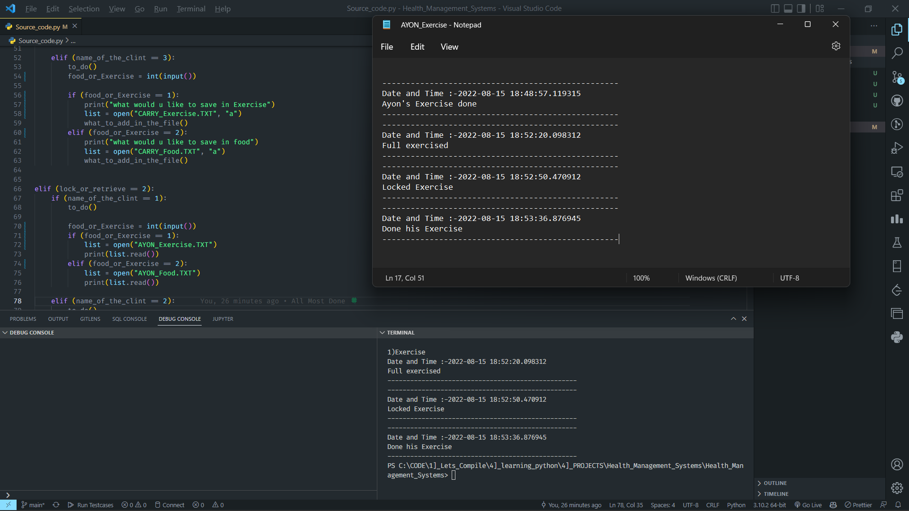

# Health_Management_Systems
You can clearly understand The Task :-  [`Video`](https://youtu.be/OM5hCIwSv1g) 

### Data store in 🪁.txt files using Python 🔥

### `Input` / `Output`
```
2022-08-15 18:50:27.346485
1)Lock
2)retrieve
1
1)AYON
2)Hacker
3)Carry
1
1)Exercise
2)Food
2
what would u like to save in food
He food items lock
UPDATE IS DONE👺
```


